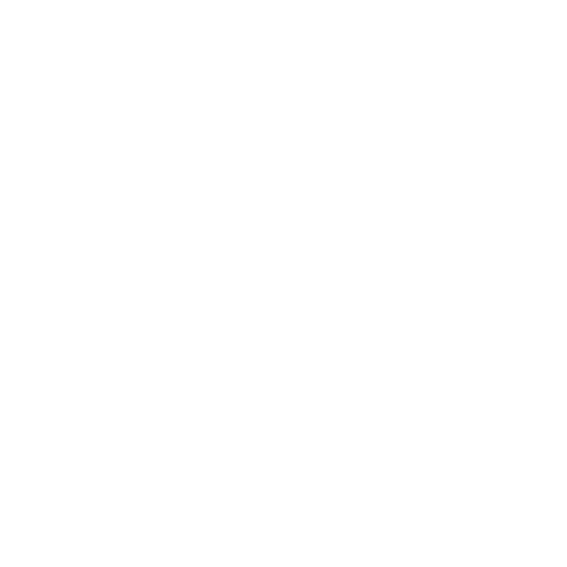

<div id="top">

<!-- HEADER STYLE: MODERN -->
<div align="center" style="width: 100%;">



# LOCAL CHESS ANALYZER

<em><em>

<!-- BADGES -->


<em>Built with the tools and technologies:</em>


<br>


</div>
</div>
<br clear="right">

---

## Table of Contents

- [Quick Download](#quick-download)
- [Overview](#overview)
- [Game review](#game-review)
- [Project structure](#project-structure)
- [Getting started](#getting-started)
- [Roadmap](#roadmap)
- [Contributing](#contributing)
- [License](#license)

---

## Quick Download

  - [macOS Apple Silicon](https://github.com/tarekchaalan/local-chess-analyzer/releases/latest/download/LocalChessAnalyzer-macOS-AppleSilicon.zip)
  - [macOS Intel](https://github.com/tarekchaalan/local-chess-analyzer/releases/latest/download/LocalChessAnalyzer-macOS-Intel.zip)
  - [Windows](https://github.com/tarekchaalan/local-chess-analyzer/releases/latest/download/LocalChessAnalyzer-Windows.zip)
  - [Linux](https://github.com/tarekchaalan/local-chess-analyzer/releases/latest/download/LocalChessAnalyzer-Linux.zip)

Unzip and run `LocalChessAnalyzer`. It opens in your browser at `http://127.0.0.1:42069`. Everything (games, analyses, settings) is stored in `data/` next to the executable — nothing leaves your machine.

---

## Overview

Private, offline game review for your **Chess.com** and **Lichess** games.

- **Any number of accounts**, on either platform, in one library. Syncs are incremental.
- **Stockfish analysis in a background queue** with live progress — close the tab, come back later, it keeps going.
- **chess.com-standard move classification**: Brilliant, Great, Best, Excellent, Good, Book, Inaccuracy, Mistake, Miss, Blunder, Forced.
- **Accuracy per player**, opening detection (ECO), evaluation graph, best lines, and clocks.
- **Insights across games**: accuracy trend, results by colour, blunder rate by time control, most played openings.
- Dark-first UI, keyboard navigation, export/import of the whole library as one SQLite file.

---

## Game review

Every move is classified from the engine's win probability (`Δ = win% before − win% after`, mover's point of view):

| Label | Rule |
| --- | --- |
| Book | Position is in the opening book (Lichess `chess-openings`, CC0) |
| Forced | Only one legal move |
| Brilliant | Best-or-near-best move that sacrifices a piece (by static exchange evaluation), not losing after, not already crushing |
| Great | The engine's top move where the second-best line is ≥10 win% worse |
| Best | The engine's top move |
| Miss | Opponent just blundered (or a mate was on) and the move gives ≥10 win% back while still ahead |
| Excellent / Good / Inaccuracy / Mistake / Blunder | Δ ≤ 2 / ≤ 5 / ≤ 10 / ≤ 20 / > 20 |

Accuracy uses the published Lichess formula; for Chess.com games their own accuracy is shown alongside for comparison.

---

## Project structure

```
backend/lca/          FastAPI app (Python 3.12, managed with uv)
  domain/             pure logic: classifier, SEE, accuracy, openings, PGN helpers
  platforms/          Chess.com and Lichess API clients
  services/           engine session, analysis pipeline, sync, job runner, stats
  api/                routers + pydantic schemas; /api/events streams progress (SSE)
  data/openings.json  ECO book (regenerate with scripts/build_openings.py)
backend/tests/        pytest suite with recorded API fixtures
frontend/src/         Svelte 5 + TypeScript SPA (no router/chart/CSS frameworks)
  lib/{router,api,stores,chess,ui,components,icons}
  routes/             Dashboard, Games, GameReview, Accounts, Settings, Setup
stockfish/            engine binaries per platform (GPL-3.0, see Copying.txt)
pyinstaller.spec      desktop bundle build; .github/workflows/release.yml publishes it
docs/superpowers/     design spec and implementation plan for v2
```

---

## Getting started

### Prerequisites

Python 3.12+, [uv](https://docs.astral.sh/uv/), Node 22+. Stockfish binaries for every platform are bundled in `stockfish/`.

### Installation

```sh
git clone https://github.com/tarekchaalan/local-chess-analyzer
cd local-chess-analyzer
(cd backend && uv sync)          # backend deps into backend/.venv
(cd frontend && npm install)     # frontend deps
```

### Usage

**Desktop app (recommended)** — download the bundle for your platform from [Releases](https://github.com/tarekchaalan/local-chess-analyzer/releases/latest), unzip, run `LocalChessAnalyzer`. Data lives in `data/` next to the executable (`lca.db`).

**Development**

```sh
# terminal 1 — API on http://127.0.0.1:42069 (docs at /docs)
cd backend && uv run uvicorn lca.main:app --reload --port 42069

# terminal 2 — UI on http://localhost:5173 (proxies /api to the backend)
cd frontend && npm run dev
```

**Docker**

```sh
docker compose up --build
```
Frontend on http://localhost:6969, API on http://localhost:42069.

### Testing

```sh
cd backend && uv run pytest && uv run ruff check
cd frontend && npm test && npm run check
```

---

## Roadmap

- [x] Multi-account sync (Chess.com + Lichess)
- [x] Background analysis queue with live progress
- [x] chess.com-standard classifications, accuracy, openings, eval graph
- [x] Cross-game insights dashboard
- [ ] PGN import from disk
- [ ] Per-opening deep dives and mistake patterns
- [ ] Engine comparison (analyse the same game with two engines)

---

## Contributing

- **🐛 [Report Issues](https://github.com/tarekchaalan/local-chess-analyzer/issues)**: Submit bugs found or log feature requests for the `local-chess-analyzer` project.
- **💡 [Submit Pull Requests](https://github.com/tarekchaalan/local-chess-analyzer/pulls)**: Review open PRs, and submit your own PRs.

<details closed>
<summary>Contributing Guidelines</summary>

1. **Fork the Repository**: Start by forking the project repository to your github account.
2. **Clone Locally**: Clone the forked repository to your local machine using a git client.
   ```sh
   git clone https://github.com/tarekchaalan/local-chess-analyzer
   ```
3. **Create a New Branch**: Always work on a new branch, giving it a descriptive name.
   ```sh
   git checkout -b new-feature-x
   ```
4. **Make Your Changes**: Develop and test your changes locally.
5. **Commit Your Changes**: Commit with a clear message describing your updates.
   ```sh
   git commit -m 'Implemented new feature x.'
   ```
6. **Push to github**: Push the changes to your forked repository.
   ```sh
   git push origin new-feature-x
   ```
7. **Submit a Pull Request**: Create a PR against the original project repository. Clearly describe the changes and their motivations.
8. **Review**: Once your PR is reviewed and approved, it will be merged into the main branch. Congratulations on your contribution!
</details>

<details closed>
<summary>Contributor Graph</summary>
<br>
<p align="left">
   <a href="https://github.com{/tarekchaalan/local-chess-analyzer/}graphs/contributors">
      
   </a>
</p>
</details>

---

## License

This project includes Stockfish, which is licensed under the GNU General Public License v3.0. See [LICENSE](./LICENSE) for details.

<div align="right">

[![][back-to-top]](#top)

</div>


[back-to-top]: https://img.shields.io/badge/-BACK_TO_TOP-151515?style=flat-square

---

